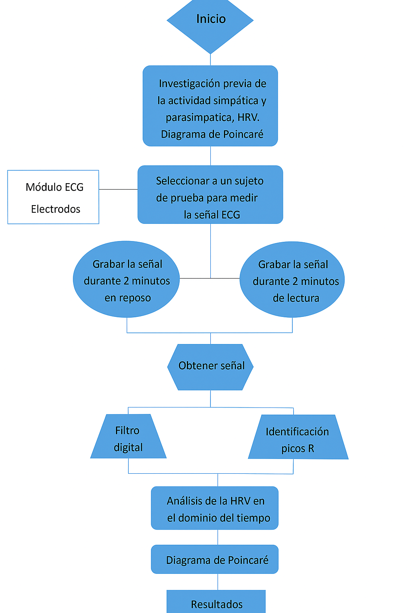
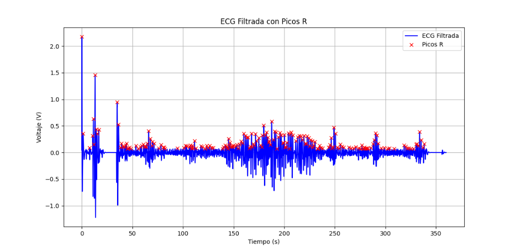
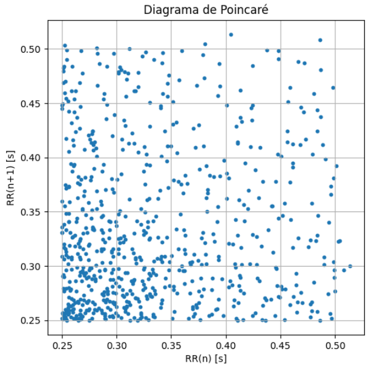

# Laboratorio-5-procesamiento
# Variabilidad de la frecuencia cardíaca (HRV) y balance autonómico

La variabilidad de la frecuencia cardíaca (HRV) es una herramienta fundamental para evaluar el equilibrio entre las ramas simpática y parasimpática del sistema nervioso autónomo. A través del análisis de los intervalos R-R obtenidos de la señal electrocardiográfica (ECG), es posible inferir cómo el organismo regula funciones involuntarias ante distintos estados fisiológicos o emocionales. Durante situaciones de reposo o estrés leve (como la lectura en voz alta) la actividad autonómica puede cambiar de manera significativa, lo cual se refleja directamente en el comportamiento temporal de la HRV.

En esta práctica de laboratorio se estudiará cómo varía la modulación autonómica cuando un sujeto pasa de un estado de reposo absoluto a una tarea que requiere activación cognitiva y verbalización. Para ello se realizará la adquisición de una señal ECG, seguida del pre-procesamiento, detección de picos R, cálculo de intervalos R-R y análisis temporal de la HRV. Además, se aplicará el diagrama de Poincaré como herramienta complementaria para evaluar la dinámica no lineal del comportamiento cardíaco. Esta introducción da paso al fundamento teórico necesario que permitirá comprender los mecanismos fisiológicos involucrados y su relación con los parámetros extraídos durante la práctica.

## PARTE A
### Fundamento teórico
### 1. Actividad simpática y parasimpática del sistema nervioso autónomo
El sistema nervioso autónomo comienza en el cerebro, e incluye parte de la corteza cerebral de la ínsula, del cíngulo, de la amígdala y del tronco cerebral; éste último incluye la región periacueductal, el hipotálamo, el núcleo parabraquial de la protuberancia, el núcleo del tracto solitario y la región ventrolateral de la médula, la que es muy importante en el control de la presión arterial.

El sistema simpático regula algunas funciones más globales y difusas, en cambio, el parasimpático provee de controles más finos. Para satisfacer esas necesidades, el sistema simpático preganglionar sinapta lejos del órgano blanco, cerca de la médula espinal o cerebro, posee una sinapsis preganglionar corta y tiene largas conexiones postganglionares, mientras que el parasimpático lo hace cerca del órgano blanco, ejerciendo un control mucho más fino.

1.1 Sistema simpático: Se activa en situaciones de estrés, peligro o ejercicio. Prepara al cuerpo para actuar rápidamente. Efectos principales: Aumenta la frecuencia cardíaca y la presión arterial, dilata los broncodilatadores (más oxígeno), inhibe la digestión, dilata las pupilas (midriasis) estimula la liberación de glucosa por el hígado, contrae los vasos sanguíneos periféricos y estimula las glándulas sudoríparas.

1.2 Sistema Parasimpático: Se activa en momentos de reposo, relajación o digestión. Favorece el ahorro y la recuperación de energía. Efectos principales: Disminuye la frecuencia cardíaca, estimula la digestión y el peristaltismo, contrae las pupilas (miosis), estimula la secreción glandular (saliva, jugos gástricos) y promueve la micción y la defecación. [1]

### 2. Efecto de la actividad simpática y parasimpática en la frecuencia cardiaca
El sistema simpático aumenta la frecuencia cardíaca y la fuerza de las contracciones del músculo cardíaco y ensancha (dilata) las vías respiratorias para facilitar la respiración. Hace que el organismo libere la energía almacenada. La fuerza muscular aumenta. Este sistema también produce sudor en las palmas de las manos, dilatación de las pupilas y erección del vello. Hace más lentos los procesos corporales menos importantes en situaciones de emergencia, como la digestión y la micción. Por otra parte, el sistema parasimpático se dedica a conservar y restaurar. Retarda la frecuencia cardíaca y disminuye la presión arterial. Estimula el tubo digestivo para procesar los alimentos y eliminar los residuos. La energía procedente de la transformación de los alimentos se utiliza para restaurar y formar tejidos. [2]

### 3. Variabilidad de la frecuencia cardíaca (HRV) obtenida a partir de la señal electrocardiográfica (ECG)
La variabilidad de la frecuencia cardíaca (HRV) se conoce como la variación en el tiempo que transcurre entre los intervalos RR del electrocardiograma y refleja la actividad del sistema nervioso autónomo sobre la función cardíaca. Su aumento se considera un factor protector para el corazón y su medición podría ser una herramienta predictiva temprana o diagnóstica en enfermedades cardiovasculares. El sistema nervioso autónomo genera efectos inotrópicos y cronotrópicos en la función cardíaca, que pueden aumentar o disminuir esta variabilidad.

El aumento o la disminución de la variabilidad de la frecuencia cardíaca están relacionados con la respuesta del sistema simpático y parasimpático; en otras palabras, la variación de tiempo en milisegundos que se da entre latido y latido está producida por la interacción del sistema nervioso autónomo con el sistema cardiovascular La frecuencia cardíaca y variabilidad de la frecuencia cardíaca son inversamente proporcionales, además en el análisis de esta variación pueden influir distintos factores como edad, género, temperatura, hora del día, estado de actividad (activo o en reposo), carga de trabajo, consumo de alcohol o tabaco, entre muchos otros.

Para medir la variabilidad de la frecuencia cardiaca se utilizan distintos métodos, entre ellos el más común es el electrocardiograma, esta técnica muestra gráficamente cada una de las ondas R que se generan con cada latido, permitiendo el análisis del tiempo en milisegundos que hay entre los intervalos RR y las pequeñas variaciones que se pueden detectar entre intervalos consecutivos.

Otra forma de medir la variabilidad de la frecuencia cardíaca es mediante los aparatos portátiles POLAR, generalmente usados por deportistas, ya que permiten cuantificar los intervalos RR mientras la persona practica ejercicio físico Con la ayuda de algunas técnicas como exponer a un paciente a estrés físico o administración de inotrópicos, se pueden hacer mediciones de laboratorio cortas de 2-5 minutos que permiten comparar la variabilidad de la frecuencia cardíaca de una persona antes y después de exponerlo a los estimuladores del sistema nervioso autónomo. [3]

### 4. Diagrama de Poincaré como herramienta de análisis de la serie R-R.
El Diagrama de Poincaré es una herramienta gráfica ampliamente utilizada para analizar la variabilidad de la frecuencia cardíaca (VFC) a partir de la serie de intervalos R-R obtenidos de un ECG. En este método, cada punto del gráfico representa la relación entre un intervalo R-R y el siguiente, es decir, se coloca R-R(n) en el eje X y R-R(n+1) en el eje Y. Esta representación permite observar de forma intuitiva cómo varía la duración de los latidos de un momento a otro, proporcionando información tanto cualitativa como cuantitativa sobre la dinámica del sistema cardiovascular.

El patrón visual del diagrama revela aspectos importantes de la regulación autonómica del corazón. Cuando los puntos están muy dispersos, se interpreta como una mayor variabilidad cardíaca, asociada normalmente a una función parasimpática saludable. En contraste, una nube de puntos compacta y rígida sugiere una disminución de la variabilidad, lo cual puede relacionarse con estrés, fatiga autonómica o ciertas condiciones patológicas. Además, la forma del conjunto de puntos suele asemejar una elipse inclinada, cuyo análisis permite identificar comportamientos normales o patrones irregulares característicos de arritmias o fibrilación auricular.

A partir de este gráfico se derivan dos parámetros clave. El primero es SD1, que representa la dispersión de los puntos perpendicular a la línea de identidad y refleja la variabilidad de corto plazo asociada principalmente a la actividad parasimpática. El segundo es SD2, que mide la dispersión a lo largo de la línea de identidad y está relacionado con la variabilidad global, influenciada tanto por el sistema simpático como por el parasimpático. La relación SD2/SD1 y el área del elipsoide formado por ambos parámetros proporcionan medidas adicionales para evaluar el balance autonómico.

El Diagrama de Poincaré es especialmente valioso porque, además de su simplicidad visual, captura características no lineales de la dinámica cardíaca que no pueden apreciarse con métodos puramente estadísticos o temporales. Por ello, se emplea en múltiples áreas, como la cardiología clínica, el análisis de estrés y sueño, la fisiología del ejercicio y el monitoreo de pacientes en entornos hospitalarios. En conjunto, esta herramienta ofrece una visión robusta y completa de la variabilidad cardíaca, permitiendo detectar alteraciones tempranas en la regulación del ritmo o identificar patrones característicos de distintas condiciones fisiológicas y patológicas.

### Plan de acción y diagrama de flujo para el desarrollo de la práctica
Luego de haber realizado la investigación anterior, se formuló el siguiente diagrama de flujo que representa el plan de acción que se llevó a cabo para el desarrollo de la práctica: 

## Adquisición de la señal

## Diseño de filtro IIR e identificación de los picos R

  
## Intervalos R-R y parámetros HRV

## Diagrama de Poincaré

